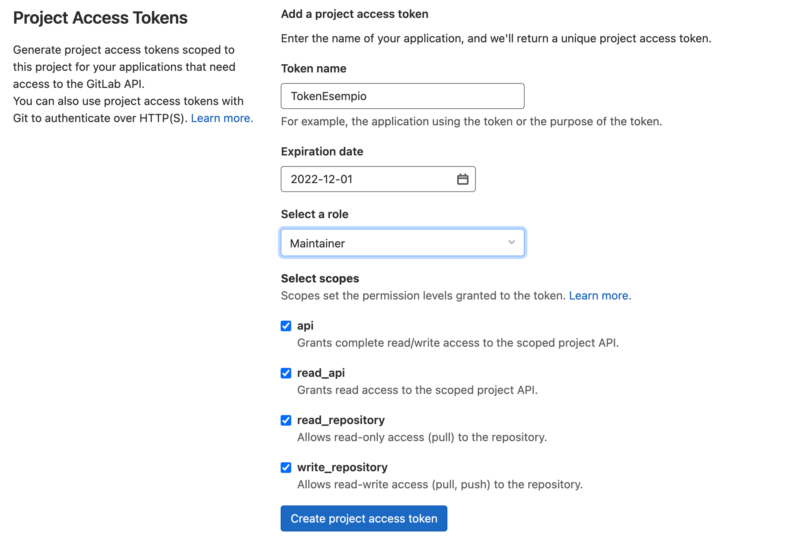

# GuardLine

# Introduzione

GuardLine è una infrastruttura DevSecOps automatizzata su Cloud per la simulazione di un ambiente reale di sviluppo sicuro del software con visualizzazione dei risultati mediante Dashboard.

DevSecOps significa integrare la sicurezza delle applicazioni e dell'infrastruttura fin dall'inizio del ciclo di sviluppo, nonché automatizzare alcune attività di controllo della sicurezza per evitare che rallentino il flusso di lavoro DevOps.

La realizzazione farà uso sia di software e framework Open Source che di implementazioni custom.

# Tools utilizzati

Per la realizzazione del progetto si è optato per l'utilizzo dei seguenti tools:

- **Docker**: per la gestione e la creazione delle istanze
- **Gitlab Server**: per la gestione di un server git con cui poter gestire il software in produzione
- **Jenkins**: per l'orchestrazione del CI/CD del software in ambito DevSecOps
- **OWASP DefectDojo**: per la gestione della Dashboard
- **SonarQube** Community Edition (v9.1): per i controlli di sicurezza relativi alla SAST (Static Application Security Testing)
- **OWASP Dependency Check** (v5.1.1)**:** Plugin di Jenkins usato per il monitoraggio della SCA (Software Composition Analysis)
- **ZAP Proxy Scanner:** Implementato mediante container Docker  ([https://hub.docker.com/r/ictu/zap2docker-weekly](https://hub.docker.com/r/ictu/zap2docker-weekly)) permette un controllo accurato della DAST (Dynamic Application Security Testing)
- **Clair Scanner** ([https://github.com/arminc/clair-scanner](https://github.com/arminc/clair-scanner)): Utilizzato per l'Image Container Scanning
- **ANY.RUN** ([https://any.run/](https://any.run/)): Permette controlli di sicurezza inerenti la Threat Analysis

# Prerequisiti

Per la realizzazione dell'infrastruttura sono tate utilizzate due istanze AWS EC2:

- (Richiesta) Un'istanza t2.xlarge con una capacità di almeno 100 GiB per la pipeline
- (Opzionale*) Un'istanza t2.large con capacità di almeno 50 GiB per il server Git

Ambedue con sistema operativo Ubuntu 20.04 LTS ed installazione di Docker (v20.10.11) e Docker Compose (v1.29.2).

Nel corso di questa documentazione, si supporrà che le istanze EC2 appena create non posseggano particolari regole di sicurezza che limitino la raggiungibilità del server dall'esterno

*L'istanza t2.large con su GitLab non è necessaria qualora si possieda già un proprio server GitLab

# Installazione

## Installazione del Server Jenkins

Effettuiamo prima di tutto l'accesso al server t2.xlarge che utilizzeremo per l'inizializzazione della pipeline di Jenkins.

Eseguito l'accesso a tale server, la prima operazione da portare a termine sarà il download della cartella compressa `devsecops.tar.gz` pubblicamente disponibile su Google Drive mediante il comando:

```bash
wget --load-cookies /tmp/cookies.txt "https://docs.google.com/uc?export=download&confirm=$(wget --quiet --save-cookies /tmp/cookies.txt --keep-session-cookies --no-check-certificate 'https://docs.google.com/uc?export=download&id=1rTll_p78MBTZjlk2ubjXO541vMzv_zDv' -O- | sed -rn 's/.*confirm=([0-9A-Za-z_]+).*/\1\n/p')&id=1rTll_p78MBTZjlk2ubjXO541vMzv_zDv" -O devsecops.tar.gz && rm -rf /tmp/cookies.txt
```

Scaricata la cartella, bisognerà decomprimerla entrare in essa con i seguenti comandi (da eseguire in successione):

```bash
mkdir DevSecOps
tar -xf devsecops.tar.gz -C DevSecOps
cd DevSecOps/
```

E digitare il seguente comando per poter far partire l'intera infrastruttura:

```bash
docker-compose up -d
```

Attenzione, il comando `docker-compose up -d` potrebbe richiedere svariati minuti prima di completare

È possibile assicurarsi che tutti i container siano stati correttamente avviati digitando il comando:

```bash
docker ps
```

Ed assicurandosi di avere una lista simile alla seguente: 


Ad infrastruttura avviata, per permettere la corretta gestione di Docker, sarà necessario eseguire sul server il seguente comando con permessi di amministratore:

```bash
sudo chmod 777 /var/run/docker.sock
```

Successivamente bisognerà accedere al container di Jenkins mediante:

```bash
docker exec -it -u root jenkins bash
```

ed eseguire il seguente comando all'interno del container di Jenkins:

```bash
chown jenkins /var/run/docker.sock
```

Questo permetterà a Jenkins di avere accesso alle socket di docker del server ospitante Jenkins in modo da rendere possibile l'esecuzione e l'avvio di container sul server dall'interno di Jenkins.

## Configurazione del Server GitLab

Una volta che il server con Jenkins è correttamente avviato e funzionante, si potrà procedere alla configurazione del proprio server GitLab.

Occorrerà come prima cosa accedere all'interfaccia grafica del server GitLab e procedere alla creazione di una nuova repository.

### Integrazione di Jenkins

Quando si sarà creata la repository, bisognerà navigare nel menù delle impostazioni ed accedere alla sezione `Settings` > `integrations` e selezionare la voce `Jenkins` dal menù `Add an integration` che compare:


Entrati nella configurazione di Jenkins, occorrerà mettere la spunta su:

- Enable Integration → `Active`
- Trigger → `Push`
- Trigger → `Merge Request`
- Trigger → `Tag Push`

Bisognerà poi inserire in:

- `Jenkins server URL` l'URL del server di Jenkins (nel caso in cui si utilizzino delle macchine AWS EC2 basterà riportare l'indirizzo IP pubblico di tali macchine) indicando la porta 8081.
    
    Esempio: http://{IP_ADDRESS}:8081
    
- `Project name` il nome del progetto di Jenkins che si vuole andare a creare
    
    Attenzione, lo stesso nome sarà poi richiesto nella configurazione di Jenkins, tenerlo a mente per l'intera durata della procedura di configurazione.
    
- `Username` e `Password` del server Jenkins che di default sono impostati ad "admin" "iUeDbbroZE0sSad5"

Di seguito un esempio di compilazione:


Si può dunque procedere a salvare la configurazione.

### Creazione Access Token

Un ulteriore step da portare a termine per la configurazione di GitLab è quello di creare un token di accesso per garantire al server di Jenkins di accedere alla repository appena creata.

Per procedere alla creazione del token, bisognerà recarsi in `Settings` > `Access Tokens` ed assegnare un nome al token da creare; bisognerà poi definire:

- Una scadenza per il token nel campo `Expiration date`
- `Maintainer` nel campo `Select a role`
- Nella sezione `Select scopes` abilitare la spunta sui campi:
    - `api`
    - `read_api`
    - `read_repository`
    - `write_repository`



Completata la procedura di creazione del token, occorrerà custodirlo in un posto sicuro poiché non sarà più possibile visionarlo e sarà necessario negli step seguenti della procedura di configurazione.

Infine bisogna scaricare il file nominato `Jenkinsfile` presente su Google Drive mediante il seguente comando:

```bash
wget --load-cookies /tmp/cookies.txt "https://docs.google.com/uc?export=download&confirm=$(wget --quiet --save-cookies /tmp/cookies.txt --keep-session-cookies --no-check-certificate 'https://docs.google.com/uc?export=download&id=1j99Nz608XjdwLJOqksR00LHd_e6oeUbK' -O- | sed -rn 's/.*confirm=([0-9A-Za-z_]+).*/\1\n/p')&id=1j99Nz608XjdwLJOqksR00LHd_e6oeUbK" -O Jenkinsfile && rm -rf /tmp/cookies.txt
```

E porre il file appena scaricato nella root folder della repository di GitLab.

## Configurazione di Jenkins

Per prima cosa collegarsi all'indirizzo IP del server alla porta 8081, per accedere all'interfaccia di Jenkins.

Effettuato l'accesso dirigersi a `Gestisci Jenkins` e successivamente a `Configurazione di sistema`.

Cercare la voce `Gitlab` e configurarla come segue:

- `Connection name`: inserire il nome del progetto inserito nella configurazione di Gitlab ("Project name")
- `Gitlab host URL`: inserire l'indirizzo IP del server Gitlab (es http://{IP_ADDRESS})
- `Credentials`: creare una nuova credenziale di tipo `Gitlab API Token` inserendo come `API token` l'access token generato precedentemente su server Gitlab.


A questo punto bisogna creare un nuovo progetto. 

Dalla dashboard di Jenkins selezionare `Nuovo elemento` e scegliere un nome per il progetto selezionando la voce `Pipeline`.

Una volta creata la Pipeline, selezionarla e dirigersi verso il pannello `Configura`.

Impostare come segue:

- Sotto la voce `Gitlab connection`: selezionare il nome della connessione precedentemente creata
- Sotto la voce `Build triggers` spuntare le caselle come segue:
    
    
    
- Sotto la voce `Pipeline` selezionare:
    - `Definition` → `Pipeline from script SCM`
    - `SCM` → `Git`
    - `URL di deposito` → inserire la URL della repository presente sul server Gitlab (es http://{IP_ADDRESS}/{REPO_NAME})
    - `Ramo` → inserire il branch della repository
    - `Script Path` → digitare `Jenkinsfile`

Salvare la configurazione.

## Configurazione SonarQube

Collegarsi al'indirizzo del server alla porta 9000 ed accedere al server di SonarQube con le credenziali di default impostate con username: "admin" e password: "admin1"

Una volta effettuato l'accesso, selezionare la voce `Create project` e `Manually`

Qui inserire in `Project display name` e in `Project key` il nome della pipeline inserito nella configurazione di Jenkins.

Impostare i quality gates in base alle proprie esigenze per far si che la pipeline si interrompa superata tale soglia (di default sono impostati per non bloccare mai la pipeline).

## Configurazione DefectDojo

Per poter accedere all'interfaccia web di DefectDojo, occorre recarsi sulla porta `8080` dell'indirizzo ip del proprio server.

Una volta caricata l'interfaccia web, occorre effettuare un login utilizzando le credenziali:

- username → `admin`
- password →`KENapkHcdG84nMrd4LLQgX`

Ad accesso eseguito, sarà necessario procedere alla creazione di un `Engagement` per poter creare un engagement, occorre prima creare un `Product.`

Per la creazione di un product, occorre recarsi dal menù di sinistra sulla schermata `Add Product`:


Dalla schermata `Add Product` possiamo procedere alla creazione compilando i campi richiesti.

Una volta salvato il product, si verrà portati sulla schermata relativa al product appena creato; da qui, bisognerà recarsi nel menù `Engagements` > `Add New Interactive Engagement`:


A questo punto si dovranno compilare i campi richiesti e salvare l'engagement

Una volta che si sarà creato l'engagement, occorre ricavarne il proprio ID che è reperibile dall'URL della pagina dell'engagement in quanto servirà nelle fasi successive.

Esempio in cui l'ID è pari a `42`:

```
http://guardline.eu:8080/engagement/42
```

Infine, bisognerà reperire il token per garantire l'accesso a DefectDojo; tale token è disponibile nel menù a tendina in alto a destra nella pagina `API v2 Key`:


## Configurazione AnyRun

Per poter utilizzare [ANY.RUN](http://ANY.RUN) sarà necessario possedere un API Token acquistabile sul sito [https://any.run/](https://any.run/)

È necessario inoltre modificare nella pipeline le seguenti variabili d'ambiente:

```jsx
'ANYRUN_TOKEN=TOKEN' Inserire il token generato sul sito any.run
'ANYRUN_ARTIFACT=target/build.jar' Artefatto da analizzare
'SECURITY_EMAIL=mail@example.com' Mail a cui inviare il report
```

Con il parametro `obj_ext_cmd=` è possibile controllare come la sandbox esegue il file. Ad esempio, nel caso di file jar si può specificare `javaw -jar %FILENAME%` .

## Configurazione Jenkinsfile

Il Jenkinsfile è lo script che viene eseguito da Jenkins che racchiude tutti i vari stage della pipeline.

Il Jenkinsfile, si compone di una sezione dedicata alle variabili d'ambiente che permettono all'intera infrastruttura di funzionare correttamente. Sara dunque necessario inserire i valori che si sono reperiti nelle fasi precedenti; in particolare:

```groovy
	.
	.
	.

  withEnv([
      'DD_ENGAGEMENT_ID="<ID ENGAGEMENT DEFECTDOJO>"',
      'DD_TOKEN=<TOKEN DI DEFECT DOJO>',
      'SQ_PROJECT_KEY=<PROJECT KEY SONARQUBE>',
      'ANYRUN_TOKEN=<TOKEN ANY RUN>',
      'EMAIL_RECEIVER="<MAIL SU CUI RICEVERE GLI AVVISI>"',
			'SECURITY_EMAIL="<MAIL SU CUI RICEVERE IL REPORT ANY.RUN>"',
			'ZAP_CONTAINERS_NAME_TO_SCAN=<LISTA CONTAINER DA SCANSIONARE (*)>',
      'SQ_TOKEN=f78d4ecd2682001d195c21bd13b0dbee4d657fe0',
      'ANYRUN_ARTIFACT=target/build.jar',
      'DOCKER_0=172.24.0.51',
  ])

	.
	.
	.
```

NB Non è necessario cambiare gli altri valori (sebbene sia consigliato modificarli per garantire una maggior sicurezza)

* Per poter eseguire la scansione con ZAP, è necessario un'istanza del progetto sia eseguita mediante Docker Compose il cui file `docker-compose.yml` deve essere posto nella root folder della repository di GitLab.
Il parametro `ZAP_CONTAINERS_NAME_TO_SCAN` contenente la lista di container da scansionare con ZAP, deve essere formata dai nomi dei container presenti nel docker compose e deve essere fornita sotto forma di unica stringa in cui i valori devono essere separati da una virgola senza alcuno spazio
Esempio:
`'ZAP_CONTAINERS_NAME_TO_SCAN=guardline,guardline_client,guardline_web'`

Attenzione, è necessario che tutti i container da scansionare con ZAP siano sulla porta 80.

Nel caso in cui sia prevista una schermata di autenticazione, è necessario aggiungere allo stage `ZAP analysis` all'ultimo comando `sh` il flag `-z` come di seguito:

```groovy
-z "auth.loginurl=<URL_PAGINA_DI_LOGIN> \                    
		auth.username="<USERNAME>" \                    
		auth.password="<PASSWORD>" \                    
		auth.username_field="<ID_CAMPO_USERNAME>" \                    
		auth.password_field="<ID_CAMPO_PASSWORD>" \"
```

Esempio:

```groovy
sh '''docker run \                
			--network=zapnet \                
			--ip=10.10.0.2 \                
			-u root\                
			-v "${workspace}/${SQ_PROJECT_KEY}/zap:/zap/wrk/:rw" \
			-t ictu/zap2docker-weekly zap-baseline.py \
			-t "http://10.10.0.3" \             
			-g gen.conf \                
			-x zap_report.xml \                
			-I \                
			-d \
			-z "auth.loginurl=<URL_PAGINA_DI_LOGIN> \                    
					auth.username="<USERNAME>" \                    
					auth.password="<PASSWORD>" \                    
					auth.username_field="<ID_HTML_CAMPO_USERNAME>" \                    
					auth.password_field="<ID_HTML_CAMPO_PASSWORD>" \"''' 
```

# Utilizzo

Per poter utilizzare la pipeline, basta eseguire un commit su GitLab e l'intero processo di scansione verrà automaticamente avviato.

Al termine della scansione, si riceverà una mail all'indirizzo indicato nel Jenkinsfile con i risultati della scansione appena effettuata.
